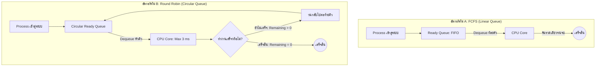

<div align="center">

# ⚡ CPU Process Scheduling Simulation
### Algorithm Design & Comparative Analysis: FCFS vs. Round Robin
**งานกลุ่มที่ 4: การออกแบบและวิเคราะห์ขั้นตอนวิธีระบบจัดคิว CPU ด้วย Java**

[](https://www.oracle.com/java/)
[](#-test-cases--verification)
[](#-system-architecture)
[](#)

<p align="center">
  <b>การจำลองและประเมินประสิทธิภาพการจัดสรร CPU สำหรับ Interactive System ระหว่าง First-Come, First-Served (FCFS) และ Round Robin (Time Quantum = 3)</b>
</p>

---

</div>

## 📌 สรุปภาพรวมเชิงเปรียบเทียบ (Executive Visual Dashboard)

```text
┌─────────────────────────┬───────────────────────────────┬───────────────────────────────┐
│       มิติการประเมิน     │      Algorithm A: FCFS        │   Algorithm B: Round Robin    │
├─────────────────────────┼───────────────────────────────┼───────────────────────────────┤
│ โครงสร้างข้อมูล (Data)   │ Linear Queue (FIFO)           │ Circular Queue (ArrayDeque)   │
│ ลักษณะการทำงาน (Mode)   │ Non-preemptive (รันจนเสร็จ)     │ Preemptive (Time Slice = 3)   │
│ Avg. Waiting Time       │ 10.25 ms  ■■■■■               │ 15.00 ms  ■■■■■■■             │
│ Avg. Turnaround Time    │ 16.75 ms  ■■■■■■■■            │ 21.50 ms  ■■■■■■■■■■          │
│ Avg. Response Time      │ 10.25 ms  ■■■■■ (ช้า/มีค้าง)    │  4.50 ms  ■■ (ตอบสนองไวมาก!)  │
│ Context Switches        │ 3 ครั้ง                       │ 9 ครั้ง (Overhead หมุนเวียน)  │
│ ความเหมาะสมกับระบบ      │ Batch Processing              │ Interactive / OS Desktop      │
└─────────────────────────┴───────────────────────────────┴───────────────────────────────┘
```

---

## 🏛️ สถาปัตยกรรมโครงสร้างคิว (System Architecture)

ระบบจำลองการทำงานบน CPU Single Core โดยเปรียบเทียบ 2 รูปแบบการเข้าคิว:



---

## 📊 ผังจำลองการทำงานบน CPU (Visual Gantt Chart)

ชุดข้อมูลทดสอบบังคับตามโจทย์: **P1 (Burst 8), P2 (Burst 4), P3 (Burst 9), P4 (Burst 5)** ที่เวลา $Arrival = 0$ และ $Quantum = 3$

### 1. FCFS Scheduling Timeline

```mermaid
gantt
    title FCFS Timeline (รวมเวลา 26 หน่วยเวลา | Context Switch = 3)
    dateFormat X
    axisFormat %s
    section Execution
    P1 (Burst 8)   :active, 0, 8
    P2 (Burst 4)   :crit,   8, 12
    P3 (Burst 9)   :active, 12, 21
    P4 (Burst 5)   :crit,   21, 26
```


### 2. Round Robin Scheduling Timeline (Time Slice = 3)

```mermaid
gantt
    title Round Robin Timeline (Quantum = 3 | Context Switch = 9)
    dateFormat X
    axisFormat %s
    section Time Slices
    P1 (3)           :active, 0, 3
    P2 (3)           :crit,   3, 6
    P3 (3)           :active, 6, 9
    P4 (3)           :crit,   9, 12
    P1 (3)           :active, 12, 15
    P2 (1) [เสร็จ]   :crit,   15, 16
    P3 (3)           :active, 16, 19
    P4 (2) [เสร็จ]   :crit,   19, 21
    P1 (2) [เสร็จ]   :active, 21, 23
    P3 (3) [เสร็จ]   :active, 23, 26
```


> 💡 **ทำไม Round Robin จึงเหมาะกับ Interactive System?**
> * ใน Round Robin ผู้ใช้จะเห็นการตอบสนองแรกของทุกโปรแกรม **ภายในเวลาไม่เกิน 9 หน่วยเวลา** ($Avg. Response = 4.50$) ทำให้หน้าจอไม่ค้าง
> * ใน FCFS หาก Process แรกใช้เวลานาน โปรเซสตัวอื่นจะต้องรอจนกว่าโปรเซสแรกจะเสร็จสิ้น เกิดปัญหา **Convoy Effect** ($P4$ ต้องรอนานถึง 21 หน่วยเวลา)

---

## 🧪 ชุดผลการทดสอบ (Test Cases Matrix)

ระบบผ่านการทดสอบครอบคลุม 6 รูปแบบบังคับ ผ่านคลาส `SchedulerTest.java` (สถานะ: **PASS 100%**):

```text
┌────────┬─────────────────────────────┬────────────────────────────────────────────────────────┬────────┐
│ รหัสเคส │        กรณีทดสอบ             │                       เกณฑ์ที่ตรวจสอบ                    │ สถานะ  │
├────────┼─────────────────────────────┼────────────────────────────────────────────────────────┼────────┤
│ TC-01  │ Normal Case (โจทย์บังคับ)     │ FCFS Avg WT=10.25, TAT=16.75 | RR Avg WT=15.00, CS=9   │ [PASS] │
│ TC-02  │ Empty Queue                 │ ส่งคิวว่าง [] ระบบไม่ Crash คืนค่า Empty List ถูกต้อง   │ [PASS] │
│ TC-03  │ Single Item                 │ มี 1 Process ทั้งสองอัลกอริทึมได้ผลเท่ากัน (CS = 0)     │ [PASS] │
│ TC-04  │ Large Queue                 │ จำลอง 10,000 Processes ประมวลผลสำเร็จเร็ว ไม่เกิด OOM  │ [PASS] │
│ TC-05  │ Edge Case (Burst <= Quantum)│ เมื่อ Burst <= 3 ทั้งคู่ทำงานเหมือนกันทุกประการ (CS=2) │ [PASS] │
│ TC-06  │ Cancel Case                 │ ยกเลิกคิวกลางแถวสำเร็จ (true) / ตัวที่ไม่มีจริง (false) │ [PASS] │
└────────┴─────────────────────────────┴────────────────────────────────────────────────────────┴────────┘
Summary: 6 passed, 0 failed
```

---

## 📈 ผลการทดลองวัดประสิทธิภาพจริง (Empirical Benchmark)

ผลการทดสอบจับเวลาจริงด้วย `System.nanoTime()` (Warm-up 5 รอบ, Fixed Seed 42, เฉลี่ย 5 รอบ):

```text
  Data Size (n)   │  FCFS Avg (ms)   │  Round Robin Avg (ms)  │  อัตราส่วนเวลา (RR / FCFS)
──────────────────┼──────────────────┼────────────────────────┼───────────────────────────
       100        │     0.065 ms     │        0.179 ms        │  2.75x   ■■■
     1,000        │     0.357 ms     │        1.297 ms        │  3.63x   ■■■■
    10,000        │     0.368 ms     │        1.693 ms        │  4.60x   ■■■■■
    50,000        │     0.453 ms     │        4.231 ms        │  9.34x   ■■■■■■■■■
```

* **การเติบโตของเวลา:** FCFS ทำงานรอบเดียวคงที่ $O(n)$ ขณะที่ Round Robin มีต้นทุน Overhead จากการหมุนเวียนคิว (Re-enqueue) และจำนวน Context Switch เพิ่มขึ้นตามขนาดข้อมูล สอดคล้องกับทฤษฎี $O(\text{TotalBurst} / \text{quantum})$

---

## 📂 โครงสร้างโปรเจกต์ (Project Structure)

```text
Group4_Queue/
├── Process.java               # คลาสโมเดลข้อมูล Process (Arrival, Burst, Remaining, Response Time)
├── FCFSScheduler.java         # อัลกอริทึม A: First-Come, First-Served Scheduler
├── RoundRobinScheduler.java   # อัลกอริทึม B: Round Robin Circular Queue Scheduler
├── Main.java                  # โปรแกรมหลักรันโจทย์ P1-P4 แสดงผลลัพธ์และตรวจสอบ Metrics
├── SchedulerTest.java         # ชุดทดสอบ Unit Tests อัตโนมัติ 6 Test Cases (TC-01 ถึง TC-06)
├── AlgorithmBenchmark.java    # ชุดรันจับเวลาประสิทธิภาพ n = 100 ถึง 50,000
```

---
